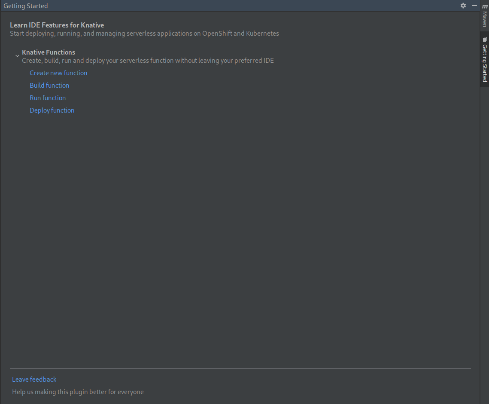
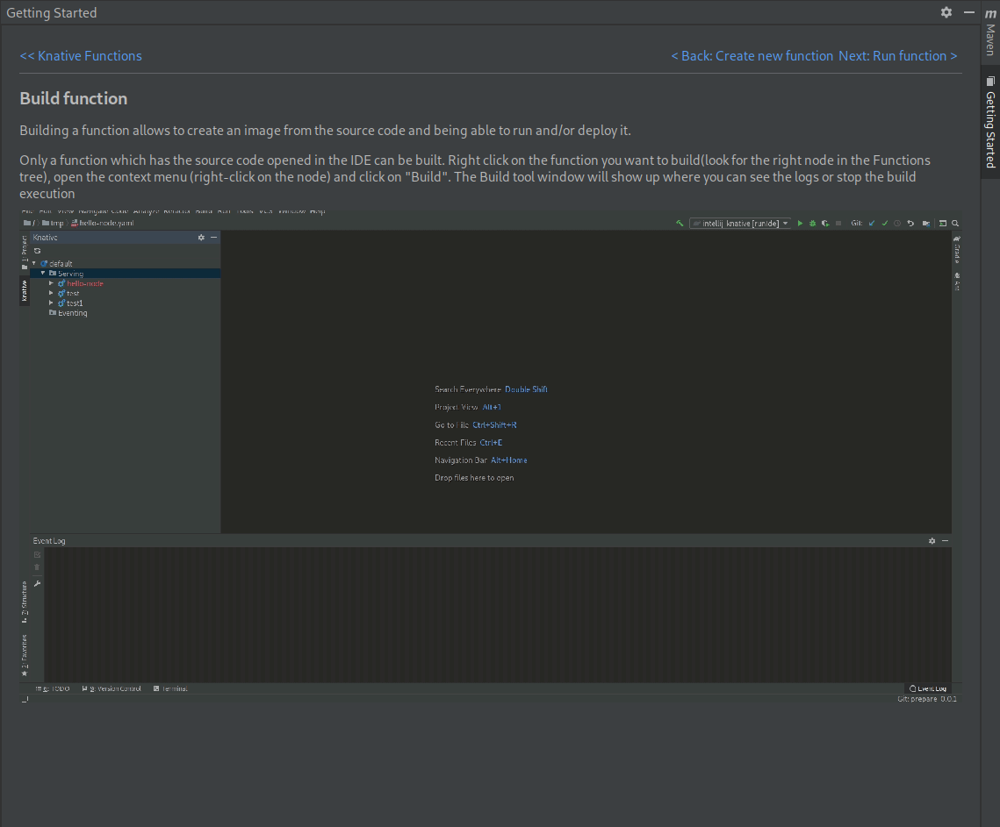

# IntelliJ Common
[release-svg]: https://img.shields.io/maven-metadata/v?metadataUrl=https%3A%2F%2Fraw.githubusercontent.com%2Fredhat-developer%2Fintellij-common%2Frepository%2Freleases%2Fcom%2Fredhat%2Fdevtools%2Fintellij%2Fintellij-common%2Fmaven-metadata.xml
[nightly-svg]: https://img.shields.io/maven-metadata/v?metadataUrl=https%3A%2F%2Fraw.githubusercontent.com%2Fredhat-developer%2Fintellij-common%2Frepository%2Fsnapshots%2Fcom%2Fredhat%2Fdevtools%2Fintellij%2Fintellij-common%2Fmaven-metadata.xml


![Release][release-svg]
![Nightly][nightly-svg]

## Overview

A JetBrains IntelliJ common library.

### Getting Started Page

The IntelliJ common library can be leveraged to create a simple `Getting Started` page for your plugin.

The Getting Started page displays a course.
A course is a collection of groups of lessons, where each lesson consists of a title, text, action buttons and a gif/image

To create a Getting Started page in your plugin, first set up your groups/lessons

```java
        GettingStartedGroupLessons group = new GettingStartedGroupLessons(
                "Knative Functions",
                "Create, build, run and deploy your serverless function without leaving your preferred IDE",
                new GettingStartedLesson(
                    "Create new function",
                    "<html>my lesson in html format here</html>",
                    Collections.singletonList(new AbstractAction() {
                        @Override
                        public void actionPerformed(ActionEvent e) {
                            // do execute
                        }
                    }),
                    myGifURL
                ),
                new GettingStartedLesson(
                .....
                )
        )
```

Next create a course using the group created above. N.B: myFeedbackURL is the page which will be opened when the `leave feedback` link is clicked
```java
        GettingStartedCourse course = new GettingStartedCourseBuilder()
                .createGettingStartedCourse(
                        "Learn IDE Features for Knative",
                        "Start deploying, running, and managing serverless applications on OpenShift and Kubernetes",
                        myFeedbackURL)
                .withGroupLessons(group)
                .build();
```

Finally you can use the course to create the content for your toolwindow

```java
        GettingStartedContent content = new GettingStartedContent(toolWindow, "", course);
        toolWindow.getContentManager().addContent(content);
```

This is the final result you should see.
Example of a main course page



Example of a lesson



## Release notes

See the change log on the [release tab](https://github.com/redhat-developer/intellij-common/releases).

Contributing
============
This is an open source project open to anyone. This project welcomes contributions and suggestions!

For information on getting started, refer to the [CONTRIBUTING instructions](CONTRIBUTING.md).


Feedback & Questions
====================
If you discover an issue please file a bug and we will fix it as soon as possible.
* File a bug in [GitHub Issues](https://github.com/redhat-developer/intellij-common/issues).

License
=======
EPL 2.0, See [LICENSE](LICENSE) for more information.
